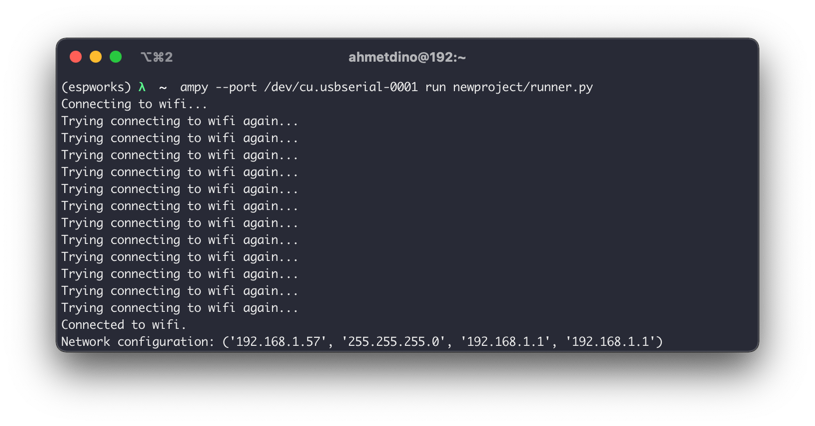
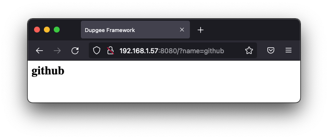
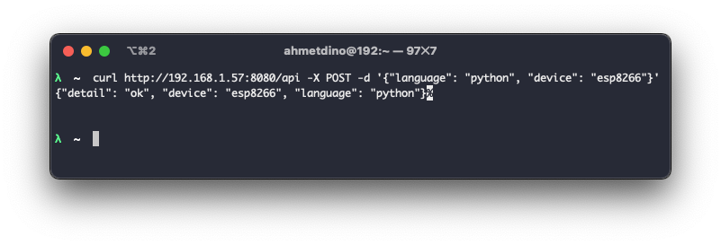

# dupgee
Dupgee is a mini web framework developed for micro-python(Tested on esp8266).

## Installation
```shell
pip install dupgee
```

## Create Project
```shell
dupgee create newproject
```

Let's code in `pages.py` and add view to `urls.py`. 
When project has created, example views and urls already exists.
Edit `WIFI_SSID` and `WIFI_PASSWORD` variables in `newproject/runner.py` file.

## Run
This operation needs `adafruit-ampy` package. See also [https://learn.adafruit.com/micropython-basics-load-files-and-run-code/install-ampy](https://learn.adafruit.com/micropython-basics-load-files-and-run-code/install-ampy) installation and other details.  

* Move files
```shell
ampy --port /dev/<your-serial-port> put newproject/
```

* Run
In host machine
```shell
ampy --port /dev/<your-serial-port> run newproject/runner.py

# or another port
ampy --port /dev/<your-serial-port> run newproject/runner.py 8000
```

In serial connected python interpreter
```python
exec(open("./newproject/runner.py").read(), globals())
```

## Test




# Contributing
See; [https://github.com/ahmetkotan/dupgee](https://github.com/ahmetkotan/dupgee)
